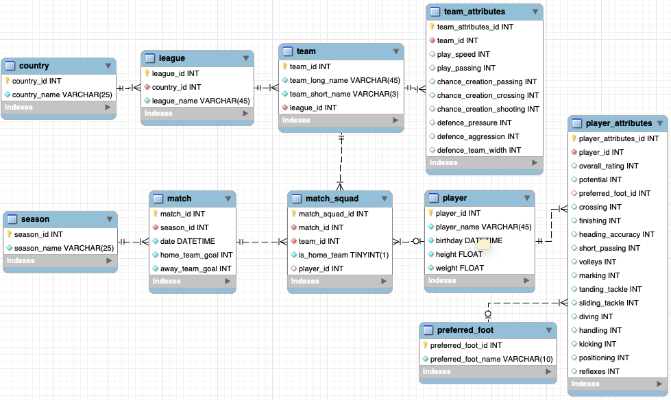

# European Football APP

## Purpose
I am planning to build an app about European football teams and players. There may be three main parts for this app. The first part lets the user choose a team he wants to search. The second part shows some information about the team the user searched. There are 12 attributes for a team, play speed, dribbling, passing, positioning, passing creation, crossing creation, shooting creating, positioning creation, defence pressure, defence aggression, team width and defender line class. The attributes will be displayed in radio graph or list format. The third part is about the players. The user can select the player he interested in from the squad list in the second part. Then some information about the player will be displayed, like height, weight, age, nationality, position and maybe some tweets or facebook posts. There are total 39 attributes for a player. The attributes will be displayed in radio graph or list format.

## Data set
There is a perfect database in sqlite format on Kaggle.com called [European Soccer Database](https://www.kaggle.com/hugomathien/soccer) which contains 7 tables, Country, League, Match, Player, Player_Attributes, Team and Team_Attributes. There are some many-to-many relationships in this database. For example, a match can have two teams to start and a team can play in many matches, a match can have more than 22 players and a player can participate in many matches. 

## Data model

:warning: The Player_Attributes and Team_Attributes tables are not complete. Because there are too many fields to type in. I just used attributes to represent all the attribute fields in the original table since they are just simple index of the table and does not involve in any key relationships.

## Package Dependencies